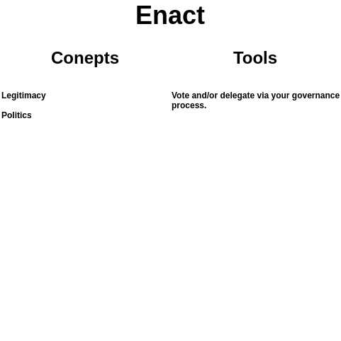

# Enact

> Picture of the Enact section (with pictures and colors) goes here. This can prime the reader for the next section and might also help to break up an otherwise monotonous wall of text.

## Overview

Decisions!

## Concepts

### Legitimacy

[Legitimacy](https://en.wikipedia.org/wiki/Legitimacy_(political)) means many things to many people. In short, it's the acknowledgement and acceptances of a power structure, and thus the [acceptance](https://vitalik.ca/general/2021/03/23/legitimacy.html)of the results of the power structure. Agree on process, even if you disagree on outcomes.

Legitimacy requires explicit and imlicit acceptance of a system. If people don't really have much of an option they'll go along with something, but then not participate or rebel half way through.

### Politics

As mentioned before, [politics](https://en.wikipedia.org/wiki/Politics) is how we make decisions in groups to distribute resources and status. While many people hate politics, as long as people are involved it's inevitable. People are going to want to advocate for their interests when valuable resources are on the line. If you have a formal political process it'll be easy to see that. If the political process is informal that doesn't mean it's not there. It just means that it's harder to see. At small scales this is usually fine, but in large systems it often just hides the (often unbalanced) power dynamics within political economies.

A political process can be healthy or unhealthy. A healthy version might look like stakeholders advocate for their interests, present evidence, engage in intelligent debate, and vote with balanced power to determine the best outcome for all parties involved. An unhealthy political process might involve stakeholders advocating for their interests and ignoring everyone else, slandering rather than engaging with facts, yelling over everyone so that no one can talk, and imbalanced power dynamics that disenfranchise stakeholders. Both are political processes, but one can be productive and the other is a nightmare. Regardless, politics is unavoidable if you're going to make decisions in a group to distribute resources.

It's important to understand how politics works in general, and then how politics (group decision making over resources) works within the context of a system. Then you can have a better idea of what you're getting into and how to engage productively.

### Participation

A political economy views individuals as the primary decision making unit.

The goal is to create a system that optimizes for allowing individuals to vote.

But for individuals rational ignorance is often the winning move

For concentrated interests the move is to lobby and fight for political power

This leads to a system that is represented by the interests of minority special interest groups rather than the will of the majority of individuals who make up the system.

How do you make it worthwhile for individuals to become informed (knwoledge) and engaged (voting)? And how do you make unbiased information available so that people can make up their own minds on complex topics?

## Tools

The process to enact proposals is dependent on the governance process of each system and therefore outside the scope of this article. That being said, it is a very important step! If you have a convoluted governance process or voting weight is not well distributed among stakeholders then success is unlikely. There isn't much that intelligent analysis, proposals, and questions can do to fix a system that is fundamentally broken. If there is a strong foundation, however, then computer aided governance can help you engage within that system productively.

