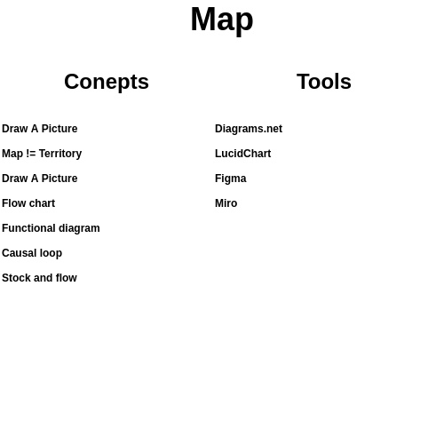

# Map

> Picture of the Map section (with pictures and colors) goes here. This can prime the reader for the next section and might also help to break up an otherwise monotonous wall of text.

## Overview

A picture says a thousand words. The same is true for maps. They can convey a lot of information quickly and intuitively. It's not a perfect representation of a thing, but it's good enough to communicate the main ideas.

## Concepts

`Would be nice if this part had pictures of the various types of maps/diagrams.`

### Draw A Picture

As Polya says in [How To Solve It](https://en.wikipedia.org/wiki/How_to_Solve_It), draw a picture! Simply sketching out your idea with pen and paper can help you understand what you know and you need to discover.

### Map != Territory

[The map is not the territory](https://en.wikipedia.org/wiki/Map%E2%80%93territory_relation) and the menu is not the meal. They're representations of things, but they are not the things themselves.

Drawing a map or diagram of your question and potential solution can help refine your thinking. It can also make it easier to convey complex information quickly.

In order to say a lot with a little you have to choose what to include and what to leave out. This is OK as long as you're clear about what you left out and why. Then the reader can better understand your thinking and what the map is trying to convey.

> What did you choose to include in your model and why?
> What did you leave out and why?

### Flow chart

A [flowchart](https://en.wikipedia.org/wiki/Flowchart) is a type of diagram that represents a workflow or process. A flowchart can also be defined as a diagrammatic representation of an algorithm, a step-by-step approach to solving a task. 

### Functional diagram

In systems engineering, software engineering, and computer science, a [functional model](https://en.wikipedia.org/wiki/Function_model) is a structured representation of the functions (activities, actions, processes, operations) within the modeled system or subject area.

### Causal loop

A [causal loop diagram (CLD)](https://en.wikipedia.org/wiki/Causal_loop_diagram) is a causal diagram that aids in visualizing how different variables in a system are interrelated.

### Stock and flow

A [stock and flow](https://en.wikipedia.org/wiki/Stock_and_flow) diagram shows the relationship between stocks (measurement of units) and flows (measurement of time). Essentially, how units change over time based on system dynamics.

## Tools

### Diagrams.net

[Diagrams.net](https://app.diagrams.net/) is a free and open source web based diagramming program.

### LucidChart

[LucidChart](https://www.lucidchart.com/) is like draw.io, but proprietary and requires a subscription.

### Figma

[Figma](https://www.figma.com/) is design software that also lets you create diagrams.

### Miro

[Miro](https://miro.com/) is visual brainstorming software that can create diagrams and pretty pictures.

