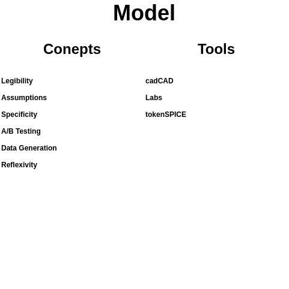

# Model

> Picture of the Model section (with pictures and colors) goes here. This can prime the reader for the next section and might also help to break up an otherwise monotonous wall of text.

## Overview

[Models](https://en.wikipedia.org/wiki/Model) allow you to define your ideas and test them in hypothetical environments. They're like thought experiments, but with code. Something in between a white paper and a working implementation. This is great if you want to test an idea before building it, or want to test variations on an idea to see which might be the best.

## Concepts

### Legibility

A model is a living document. It conveys information, but you can also modify and interact with it to learn new information. The results of running a model are only a small part of it's value. Most of the value comes from people's ability to explore and modify the parameters and assumptions within the model to better understand somethin. This requires your model to be legible. Check out the `[insert python/cadCAD code syntax and best practices guide here]` to see some examples.

- Is your model structured so that it's easy to interact with?
- Could people easily modify it to test your assumptions and their own?

### Assumptions

Models make assumptions about the world in order to focus on the thing that is being modeled. The model is a representation of a thing, not the thing itself. Just like with a map, it's important to specify what you included, what you left out, and why. It's also important to specify what you're assuming to be true and/or external states/environments that you assume the model is operating within.

- What does your model assume or require to be true?
- Are these assumptions stated explicitly?

### Specificity

Specificity is opposite of assumptions. It's what the model is exploring in detail. 

- What question is the the model exploring?
- What did you choose to be specific about in relation to this question?
- Is your model specific enough that it defines the problem and the potential solution?

### A/B Testing

[A/B testing](https://en.wikipedia.org/wiki/A/B_testing) allows you to test multiple variations of a thing. This is very important if you see how a proposed solution might behave under a wide range of assumptions. Be aware that A then B is not the same as testing A and B simultaneously. Statefulness and ordering is important. The later compares A and B against the same data and this is what we're talking about when we say A/B testing.

- Test the same idea under multiple contexts.
- Test multiple ideas within the same context.

### Data generation

Models also allow you to generate new data. This can be useful if you want to test alternate scenarios and explore the state space more than what would be possible with historical data. 

If your assumptions are made explicit then you can also test your model in different contexts. That way you can have a better idea of under what macro conditions your assumptions might hold.

### Reflexivity

Reflexivity happens when multiple variables within the model feed into each other. This can create exponential amplification or suppression of metrics. This throws off wild data that makes it difficult to gain any understanding from the model. If there's any reflexivity involved make sure it's there for a very good reason and you understand exactly how it works.

- Are there any portions of your model that are self referential or that refer to each other in a loop?

## Tools

### cadCAD

[cadCAD](https://cadcad.org/) is an open-source Python package that assists in the processes of designing, testing and validating complex systems through simulation. Download it, check out demos, and fork snippets into your own models from the [cadCAD repos](https://github.com/cadCAD-org).

### Labs

> Is there public data/tooling available for BlockScience Labs yet?

### tokenSPICE

[Token](https://en.wikipedia.org/wiki/Token) - A thing that represents a thing.

[SPICE](https://en.wikipedia.org/wiki/SPICE) - "Simulation Program with Integrated Circuit Emphasis"

Ocean Protocol has created tokenSpice to model their token system dynamics. It's agent based and V2 even has EVM integration with Ganache. Check out the code and fork it for your experiments here:

- [tokenSPICE V1](https://github.com/oceanprotocol/tokenspice)
- [tokenSPICE V2](https://github.com/oceanprotocol/tokenspice2)

