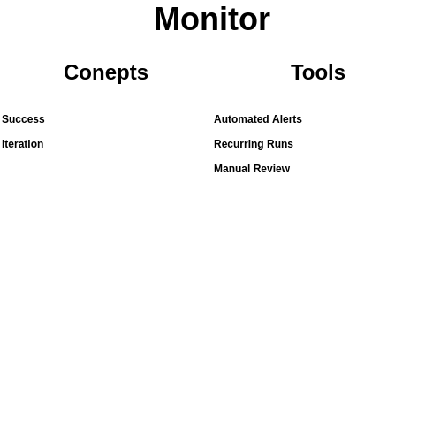

# Monitor

> Picture of the Monitor section (with pictures and colors) goes here. This can prime the reader for the next section and might also help to break up an otherwise monotonous wall of text.

## Overview

Science wouldn't work if we ran experiments but didn't bother to record the results. Same goes for governance. There needs to be a feedback loop between decisions and results. Monitoring allows you to verify the results of proposals to see if they had their intended effects. If so, great. If not, then you know what the results were and you can draft a proposal to change things and try again.

## Concepts

### Success

If the proposal passes monitor the relevant metrics to ensure it behaves as expected. If not, suggest ways to adjust accordingly.

### Iteration

If the proposal does not pass still monitor the relevant metrics to see if your prediction holds (then you can say "I told you so" and/or give your proposal another go if it's still relevant).

## Tools

### Automated Alerts

If possible setup automated alerts for activity that matters in the context of a proposal. This way you can know if expected milestones/thresholds/etc were reached and/or what performance looks like.

### Recurring Runs

If you can get a raw data-feed from the system, you might be able to pipe that into your model and setup recurring runs. This would regularly pull new data into the model and run it to see if anything changed. This can provide more detailed insights than simple metrics. You'll also be able to modify the model to explore potential future scenarios based on new updates.

### Manual

Not all data is packaged in a convenient numerical format. Sometimes you need to also review human readable proposals and/or gauge sentiment on community forums and chats. This can sometimes provide insight related to the satisfaction and/or desires of stakeholders. This is important because governance proposals determine how resources are distributed between stakeholders so even if the results are technically what was expected, if stakeholders are unhappy then it's important to understand why and take that into consideration. 

